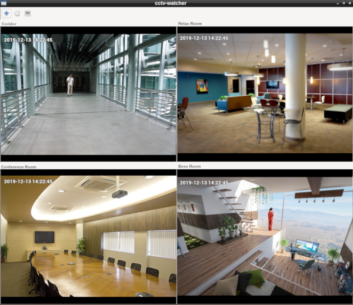

<div align="center">
  
</div>

# CCTV Watcher

Application for CCTV cameras monitoring. RTSP, MJPEG, V4L2 cameras supported.

## Requirements

* Gstreamer (gstreamer-libav, gstreamer-rtsp, gstreamer-gtk)
* Gtk
* libgudev

## Build & Install

```bash
meson build --prefix=/usr
cd build
ninja
sudo ninja install
```

## Install from Arch Linux & Manjaro 

```bash
yaourt -S cctv-watcher
```
